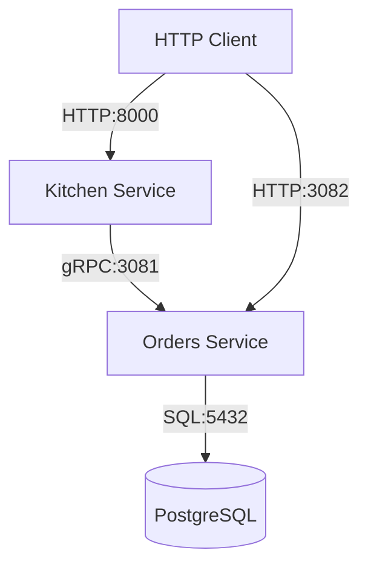

# User Manual

## Project Structure
The project follows a microservices architecture with a CLI-driven entry point.

- `cmd/`: **CLI Layer**. Contains command definitions and configuration logic.
  - `config/`: Reusable configuration components (Viper-based).
  - `kitchen/`: CLI commands for the Kitchen service.
  - `orders/`: CLI commands for the Orders service.
- `services/`: **Business Logic**.
  - `kitchen/`: Implementation of the Kitchen microservice.
  - `orders/`: Implementation of the Orders microservice.
  - `common/`: Shared code, gRPC generated code, and types.
- `internal/`: **Shared Core**. Logging, server abstractions, database utilities, and networking.
- `protobuf/`: Protocol Buffer definitions.
- `migrations/`: Database migration files (managed by `goose`).

## Configuration
The application uses **Viper** for flexible configuration. Settings are resolved in the following priority:
1. **CLI Flags** (e.g., `--db-host`)
2. **Environment Variables** (e.g., `DATABASE_HOST`)
3. **YAML Config Files** (e.g., `root_config.yaml`)
4. **Defaults** hardcoded in the source code.

### Sample Configuration Files
Sample files are provided for each component:
- `root_config-sample.yaml`: Global CLI settings (debug, silent, colors).
- `services/kitchen/config-sample.yaml`: Kitchen service settings (port, test variables).
- `services/orders/config-sample.yaml`: Orders service settings (database, gRPC/HTTP ports).

To use them, copy the sample file to a file named `config.yaml` in the respective directory.

### Environment Variable Overrides
All configuration keys can be overridden via environment variables. Nested keys use underscores as separators:
- `DATABASE_HOST` overrides `database.host`
- `ORDERS_HTTP_PORT` overrides `orders.http.port`
- `KITCHEN_PORT` overrides `kitchen.port`

## Command Line Interface (CLI)
The project is driven by a Cobra-based CLI.

### Global Flags
To get help on any command:
```bash
go run main.go [command] --help
```

### Main Commands
- **Run All Services**: `go run main.go run` (orchestrates all microservices).
- **Service Specific**: `go run main.go [service] run` (e.g., `orders`, `kitchen`).
- **Migrations**: `go run main.go [service] migrate [ARGS]` (e.g., `go run main.go orders migrate up`).

## Project Management (Makefile)
Common tasks are simplified via `Makefile`:
- `make run-all`: Run the entire application.
- `make migrate-all`: Run migrations for all services.
- `make run-orders` / `make run-kitchen`: Run specific services.
- `make gen-go`: Generate Go code from Protobuf.

## Docker Usage
The project is fully containerized.

### Running with Docker Compose
To start the entire stack (including Postgres):
```bash
docker compose up --build
```

### Microservices Overview

The project consists of two main microservices that interact to handle order processing.

### Orders Service
- **Role**: Manages the core order lifecycle and persists data to the PostgreSQL database.
- **Endpoints**:
    - **HTTP (Port 3082)**:
        - `POST /orders`: Create a new order.
        - `GET /orders`: List existing orders (supports `limit` and `offset` query parameters).
        - `POST /customers`: Create a new customer (requires `name`).
        - `GET /customers`: List existing customers.
        - `POST /products`: Create a new product (requires `title` and `description`).
        - `GET /products`: List existing products.
    - **gRPC (Port 3081)**:
        - `CreateOrder`: Internal endpoint for order creation.
        - `ListOrders`: Internal endpoint for retrieving orders.
        - `CreateCustomer`: Internal endpoint for customer creation.
        - `ListCustomers`: Internal endpoint for retrieving customers.
        - `CreateProduct`: Internal endpoint for product creation.
        - `ListProducts`: Internal endpoint for retrieving products.

### Kitchen Service
- **Role**: Acts as a gateway/orchestrator for kitchen-related operations. It currently proxies order requests to the Orders service via gRPC.
- **Communication**: Uses **gRPC** to communicate with the Orders service.
- **Endpoints**:
    - **HTTP (Port 8000)**:
        - `POST /orders`: Proxies order creation to the Orders service.
        - `GET /orders`: Proxies order listing to the Orders service.

## Inter-Service Communication

The following diagram illustrates the communication flow:



## HTTP Messages

### Create Order (`POST /orders`)
**Request Body**:
```json
{
  "customer_id": 123,
  "product_id": 456,
  "quantity": 2
}
```

### List Requests (`GET /orders`, `GET /customers`, `GET /products`)
**Query Parameters**:
- `limit`: Number of items to return (default: 10).
- `offset`: Number of items to skip (default: 0).

**Response Structure**:
```json
{
  "data": [...],
  "metadata": {
    "total": 100,
    "limit": 10,
    "offset": 0
  }
}
```

### Create Customer (`POST /customers`)
**Request Body**:
```json
{
  "name": "John Doe"
}
```

### Create Product (`POST /products`)
**Request Body**:
```json
{
  "title": "Pizza",
  "description": "Delicious pepperoni pizza"
}
```

## Future plans:
1) minimize goroutines memory leak :white_check_mark:
2) add title to HTTP and gRPC servers :white_check_mark:
3) set up database connection :white_check_mark:
